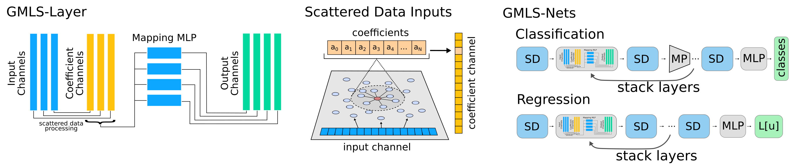

# GMLS-Nets

<div  align="center">

</div>

__GMLS-Nets (PyTorch Implementation)__

Package provides machine learning methods for learning features from scattered unstructured data sets using Generalized Moving Least Squares (GMLS).  Provides techniques which can be used to generalize approaches, such as Convolutional Neural Networks (CNNs) which utilize translational and other symmetry, to unstructured data.  GMLS-Nets package also provides approaches for learning differential operators, PDEs, and other features from scattered data.  

__Quick Start__

*Method 1:* Install for python using pip

```pip install -U gmlsnets-pytorch```

For use of the package see the [examples page](https://github.com/atzberg/gmls-nets/tree/master/examples).  For getting the latest version use ```pip install --upgrade gmlsnets-pytorch```.  More information on the structure of the package also can be found on the [documentation page](https://github.com/atzberg/gmls-nets/tree/master/docs).

If previously installed the package, please update to the latest version using ```pip install --upgrade gmlsnets-pytorch```

__Manual Installation__

*Method 2:* Download the [gmlsnets_pytorch-1.0.0.tar.gz](https://github.com/atzberg/gmls-nets-testing/blob/master/gmlsnets_pytorch-1.0.0.tar.gz) file above, then uncompress 

``tar -xvf gmlsnets_pytorch-1.0.0.tar.gz`` 

For local install, please be sure to edit in your codes the path location of base directory by adding

``sys.path.append('package-path-location-here');`` 

Note the package resides in the sub-directory ``./gmlsnets_pytorch-1.0.0/gmlsnets_pytorch/``

__Packages__ 

Please be sure to install [PyTorch](https://pytorch.org/) package >= 1.2.0 with Python 3 (ideally >= 3.7).  Also, be sure to install the following packages: numpy>=1.16, scipy>=1.3, matplotlib>=3.0.

__Use__

For examples and documentation, see

[Examples](https://github.com/atzberg/gmls-nets/tree/master/examples)

[Documentation](http://web.math.ucsb.edu/~atzberg/gmlsnets_docs/html/index.html)

__Additional Information__

If you find these codes or methods helpful for your project, please cite: 

*GMLS-Nets: A Framework for Learning from Unstructured Data,* 
N. Trask, R. G. Patel, B. J. Gross, and P. J. Atzberger, arXiv:1909.05371, (2019), [[arXiv]](https://arxiv.org/abs/1909.05371).
```
@article{trask_patel_gross_atzberger_GMLS_Nets_2019,
  title={GMLS-Nets: A framework for learning from unstructured data},
  author={Nathaniel Trask, Ravi G. Patel, Ben J. Gross, Paul J. Atzberger},
  journal={arXiv:1909.05371},  
  month={September}
  year={2019}
  url={https://arxiv.org/abs/1909.05371}
}
```
For [TensorFlow](https://www.tensorflow.org/) implementation of GMLS-Nets, see https://github.com/rgp62/gmls-nets.

__Acknowledgements__
We gratefully acknowledge support from DOE Grant ASCR PHILMS DE-SC0019246.

----

[Examples](https://github.com/atzberg/gmls-nets/tree/master/examples) | [Documentation](http://web.math.ucsb.edu/~atzberg/gmlsnets_docs/html/index.html) | [Atzberger Homepage](http://atzberger.org/)
