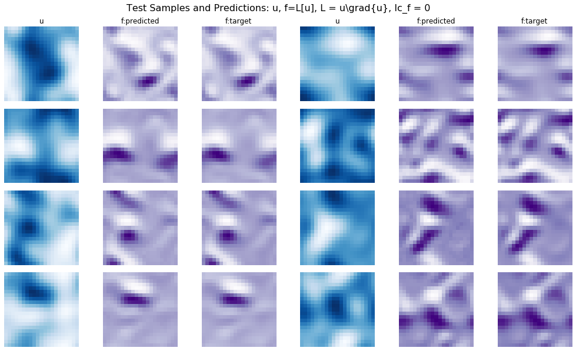

For more information on how to use this package, see the example Jupyter notebooks and python scripts above.  More information on the structure of the package can also be found on the 
[documentation page](http://web.math.ucsb.edu/~atzberg/gmlsnets_docs/html/index.html)

<<<<<<< HEAD
[!Image](z_doc_img/diff_op_2d_1.png)
=======

 

>>>>>>> 76662ed2b471c38b40d3c405ca4293f17ad1c20d

